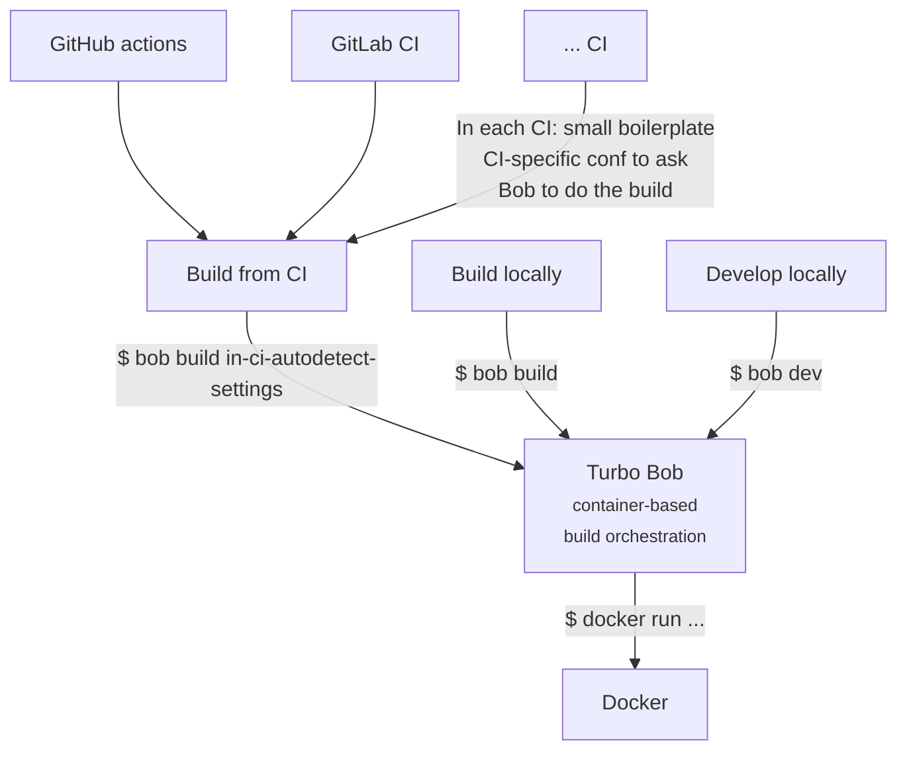
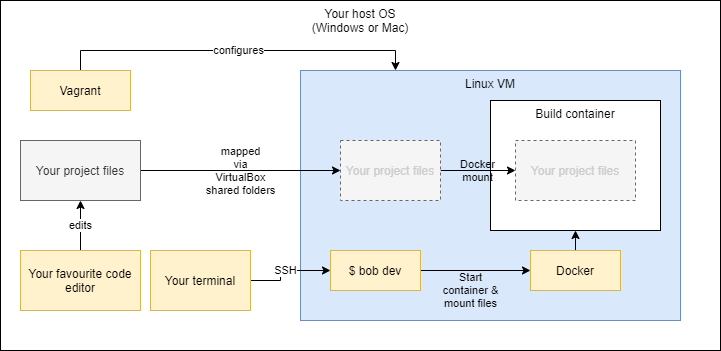

[](https://github.com/function61/turbobob/releases)


Modern, minimal container-based build/development tool to make any project´s dev easy and
frictionless.

Think like GitHub actions, but actually runnable locally (and also runnable from GitHub actions).

Note: while Bob uses containers for builds (and dev), your programs themselves don't need to use containers!


Developing
----------

If you want to use [Turbo Bob](https://github.com/function61/turbobob):

- to build: run `$ bob build`
- to develop: run `$ bob dev`

If you don't want to use Turbo Bob, to build ..:

```shell
docker run --rm -it --user 0:1000 -v=$(pwd):/workspace --volume /tmp/build:/tmp/build fn61/buildkit-golang:20250109_1140_037f68db build-go-project.sh --directory=cmd/bob/ --binary-basename=bob
```

.. and to develop:

```shell
docker run --rm -it --user 0:1000 -v=$(pwd):/workspace --volume /tmp/build:/tmp/build fn61/buildkit-golang:20250109_1140_037f68db bash
```

> [!TIP]
> Builder image [documentation](https://github.com/function61/buildkit-golang) available.
> Description: Frequently needed tools for building Go-based projects. Internally runs just the regular `$ go build` but also runs tests, lint etc.


In a nutshell
-------------



Notes:

- Here's what the [GitHub actions boilerplate](https://github.com/function61/turbobob/blob/8ced488edb65fd99c718586a56ecdf5882307c70/.github/workflows/build.yml#L14) looks like for just passing the build to Bob
    * You can think of these as CI-specific adapters for passing control to Turbo Bob
- Then [here's the container image that gets run to do the build](https://github.com/function61/turbobob/blob/51e6c7f5c5b0e7b0c244d670410e6c1a383429a6/turbobob.json#L9)
    * This is reusable container to build all our Go-based projects, i.e. the build environment can be shared across many projects. Ship one improvement to the build environment -> many projects benefit.

Small demo screencast
---------------------


Features
--------

- [GitHub Codespaces](misc/turbobob-codespace) support
- [Log line grouping](https://user-images.githubusercontent.com/630151/194755923-d81df7cf-1e80-40b8-b1b3-886d973fdb4d.mp4) in GitHub actions
- Automatically adds [OCI-compliant metadata](https://github.com/opencontainers/image-spec/blob/main/annotations.md)
  to built containers. ([Example](https://hub.docker.com/r/joonas/hellohttp/tags), click "latest")


Additional documentation
------------------------

- [Using Bob in your project](docs/using-bob-in-your-project/README.md) (also covers
  making your own builder images - "buildkits")
- [ENV vars passed to build containers](docs/env-vars-passed-to-build-containers/README.md)
- [Displaying pro-tips on entering the dev environment](docs/dev-pro-tips/README.md) (also covers mapping network ports)
- [Development-time HTTP ingresses](docs/development-time-http-ingresses/README.md) (routing HTTP requests)
- [Customizing dev container startup](docs/customizing-dev-container-startup/README.md)
- [Language server support](docs/language-server-support/README.md) (code completion, analysis, refactoring support etc. for code editors)
- [Quality helpers](docs/quality-helpers/README.md) (multi-project quality scalability by automatically checking standards-compliance like having README, LICENSE, security policy etc.)


What is this?
-------------

Turbo Bob (the builder) is an abstraction for building and developing your software, whether it happens in your laptop or in a CI system.

Usage of Turbo Bob, in every project you're developing:

```console
$ bob dev
```

This gives you a shell inside the build environment container with the working directory mounted inside the container so that you can directly edit your code files from your host system.

To build your project:

```console
$ bob build
```

By keeping these commands consistent across each project we'll minimize friction with
mental context switching, since the commands are the same for each project whether
you're building a Docker-based image or running anything custom that produces build
artefacts.

There's a [document that your project can link to](docs/external-how-to-build-and-dev.md)
for build & help instructions. This explains Bob's value proposition quite well and serves
as the first introduction for new Bob users. See an
[example of a project's build docs linking to Bob](https://github.com/function61/ruuvinator#how-to-build--develop).


Philosophy
----------

- Your project must support a simple `build` and `dev` interface. If you can't, you're
  probably doing something wrong and you should simplify it. The `build` command usually just
  runs your project's `bin/build.sh` (or equivalent) command inside a container. The `dev`
  command usually starts Bash terminal inside the container but doesn't execute `bin/build.sh`
  so you can manually invoke or debug the build process (or a subset of it).

- Build environment should be stateless & immutable. No longer missing build tools or
  mismatched versions within your team. Nothing to install on your CI server (except Docker).

- Decouple build-time dependencies from runtime dependencies
  ([build container pattern](https://medium.com/@alexeiled/docker-pattern-the-build-container-b0d0e86ad601)),
  so build tools will not be shipped to production (smaller images & less attack surface).

- Dev/CI/production environment parity as close as possible. Dev environment is the same as
  build & CI environment. What's built on dev (`$ bob build`) is exactly the same or as
  close as possible (`$ bob build --uncommitted`) as to what will end up running in production.

- No vendor lock-in for a CI system. Bob can seamlessly build projects on your laptop, GitHub actions,
  Jenkins, GitLab etc. CI needs to only provide the working directory and Docker - everything
  else like uploading artefacts to S3, Bintray etc. should be a build container concern to
  provide full independence.


Install
-------

### Linux

Requires Docker for use, so currently only Linux is supported. Native Windows support might
come later as Windows' Linux subsystem keeps maturing.

```console
$ sudo curl --location --fail --output /usr/bin/bob https://function61.com/go/turbobob-latest-stable-linux-amd64 && sudo chmod +x /usr/bin/bob
```

### Windows

I have used Turbo Bob in Windows through [Vagrant](https://www.vagrantup.com/) (= run Linux
in VM) quite succesfully for years.

I can edit my project files from the Windows host and those changes reflect inside the
container just fine, though the Linux setup is definitely simpler and has less moving parts.
The setup looks like this:




### Mac

I have no experience whatsoever with Mac, but I hear Vagrant works on Mac so maybe it
works the same way I described it works on Windows.


Supported build/CI platforms
----------------------------

Basic approach anywhere:

1. Have Docker installed
2. If you don't have Turbo Bob installed, download it
3. Run `$ bob build` (i.e. hand off build to it)


### Your own computer

If your system can run Docker locally, you can build projects on your own computer.


### GitHub actions

See [example actions workflow file](.github/workflows/build.yml).

GitHub actions' design is pretty similar to Turbo Bob's design ("run stuff inside containers").
I started this project before actions was announced, so unfortunately there's currently no
synergy with these projects. I'd like to research if Bob concepts could directly be mapped
into actions' concepts (perhaps you could just generate actions' workflow file from
turbobob.json).


### GitLab

I've built projects on GitLab's public runners with Bob. See
[example configuration](https://github.com/function61/turbobob/blob/8156ab2bc400181cb74b8ea324fa98a3fb9e82d2/cmd/bob/init.go#L56).


### Other CI systems, vendor lock-in

Bob's approach is pretty generic (as documented under the above larger heading).

Here's a commit demonstrating how portable Bob is by
[moving from Travis CI -> GitHub actions](https://github.com/function61/buildkit-publisher/commit/62f1b71ed6a17489394ccd431763ee36c958fb92) -
how it's just from small boilerplate to small boilerplate. This prevents vendor lock-in.
(NOTE: GitHub actions boilerplate has since been [updated](.github/workflows/build.yml)).

If you've added support to other public CI systems, please add links to here for instructions!


Examples / how does it work?
----------------------------

**NOTE: The easiest way to understand is to read "Using Bob in your project" first!**


### Examples

Look for the `turbobob.json` file in each of these example repos. Most of them use multiple
container images ("buildkits") for builds:

- This project itself
- [function61/james](https://github.com/function61/james)
  * uses [buildkit-golang](https://github.com/function61/buildkit-golang)
  * uses [buildkit-publisher](https://github.com/function61/buildkit-publisher)
- [function61/lambda-alertmanager](https://github.com/function61/lambda-alertmanager)
  * uses [buildkit-golang](https://github.com/function61/buildkit-golang)
  * uses [buildkit-js](https://github.com/function61/buildkit-js)
  * uses [buildkit-publisher](https://github.com/function61/buildkit-publisher)
- [function61/hautomo](https://github.com/function61/hautomo)
  * uses [buildkit-golang](https://github.com/function61/buildkit-golang)
  * uses [buildkit-js](https://github.com/function61/buildkit-js) (via `build-alexaconnector.Dockerfile`)
  * uses [buildkit-publisher](https://github.com/function61/buildkit-publisher)


### How does turbobob.json work?

The process is exactly the same whether you use a different CI system. You can even run
builds exactly the same way on your laptop by just running `$ bob build`.

This very project is built with Bob on GitHub actions. The [workflow configuration](.github/workflows/build.yml) is
minimal. Here's what happens when a new commit lands in this repo:

- GitHub actions start processing the build workflow file which:
  * Downloads Turbo Bob
  * Hands off build process to Bob
- Bob reads [turbobob.json](turbobob.json), which instructs to:
  * Run container off of image `fn61/buildkit-golang`
    ([repo](https://github.com/function61/buildkit-golang)) and run
    [build-go-project.sh](https://github.com/function61/buildkit-golang/blob/a687e81c0c7e4ca76e759d2f521a696732d2d98e/build-go-project.sh)
    (defined by the buildkit) inside it. We could of course store the build script in our own repo,
    but it's advantageous to have it defined by the buildkit, so improvements can "automatically" ship to multiple projects.
  * For publishing step, run container off of image `fn61/buildkit-publisher`
    ([repo](https://github.com/function61/buildkit-publisher)) and run `publish.sh rel/`
    inside it (again defined by the buildkit)


### Why multiple buildkits?

If your project e.g. uses Go for backend and TypeScript for frontend, it's hygienic to
keep the build tools separate so:

- They can't conflict with each other.
- One buildkit doing one thing enables reusability.
  * All of function61's projects use `buildkit-golang`. The decision has already
    [paid itself back](https://twitter.com/joonas_fi/status/1227522075780354048).
- It also allows the build environments to evolve independently (update another buildkit
  without breaking others).
- Increases your chances of finding community-provided buildkits so you don't have to
  maintain your own.

p.s. "buildkit" is not a Turbo bob concept per se. It just means "a container image with
tooling". You can probably use images with Turbo Bob that aren't designed with Turbo Bob in mind.


Alternative software
--------------------

These technologies have some overlap with Turbo Bob:

- [Visual Studio Code Dev Container](https://code.visualstudio.com/docs/remote/containers) - tools inside container
- [GitHub codespaces](https://github.com/features/codespaces) - Code editor in cloud + tools inside container?
- [nektos/act](https://github.com/nektos/act) - Run your GitHub Actions locally
