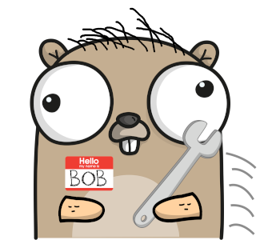
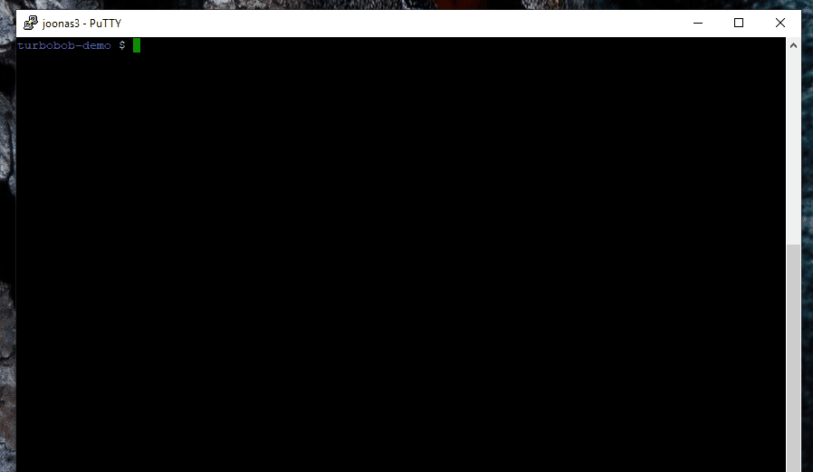

[](https://travis-ci.org/function61/turbobob)
[](https://bintray.com/function61/dl/turbobob/_latestVersion#files)

Modern, minimal container-based build/development tool to make any project´s dev easy and frictionless.



Contents:

- [What is this?](#what-is-this)
- [Documentation](#documentation)
- [Philosophy](#philosophy)
- [Install](#install)
  * [Linux](#linux)
  * [Windows](#windows)
  * [Mac](#mac)
- [Supported build/CI platforms](#supported-build-ci-platforms)
  * [Your own computer](#your-own-computer)
  * [GitHub actions](#github-actions)
  * [Travis CI](#travis-ci)
  * [GitLab](#gitlab)
  * [Other CI systems](#other-ci-systems)
- [Examples / how does it work?](#examples--how-does-it-work)
  * [Examples](#examples)
  * [How does turbobob.json work?](#how-does-turbobobjson-work)
  * [Why multiple buildkits?](#why-multiple-buildkits)


What is this?
-------------

Turbo Bob (the builder) is an abstraction for building and developing your software, whether it happens in your laptop or in a CI system.

Usage of Turbo Bob, in every project you're developing:

```console
$ bob dev
```

This gives you a shell inside the build environment container with the working directory mounted inside the container so that you can directly edit your code files from your host system.

To build your project:

```console
$ bob build
```

By keeping these commands consistent across each project we'll minimize friction with
mental context switching, since the commands are the same for each project whether
you're building a Docker-based image or running anything custom that produces build
artefacts.

There's a [document that your project can link to](docs/external-how-to-build-and-dev.md)
for build & help instructions. This explains Bob's value proposition quite well and serves
as the first introduction for new Bob users. See an
[example of a project's build docs linking to Bob](https://github.com/function61/ruuvinator#how-to-build--develop).


Documentation
-------------

- [Using Bob in your project](docs/using-bob-in-your-project/README.md)
  * Also covers making your own builder images ("buildkits")


Philosophy
----------

- Your project must support a simple `build` and `dev` interface. If you can't, you're
  probably doing something wrong and you should simplify it. The `build` command usually just
  runs your project's `bin/build.sh` (or equivalent) command inside a container. The `dev`
  command usually starts Bash terminal inside the container but doesn't execute `bin/build.sh`
  so you can manually invoke or debug the build process (or a subset of it).

- Build environment should be stateless & immutable. No longer missing build tools or
  mismatched versions within your team. Nothing to install on your CI server (except Docker).

- Decouple build-time dependencies from runtime dependencies
  ([build container pattern](https://medium.com/@alexeiled/docker-pattern-the-build-container-b0d0e86ad601)),
  so build tools will not be shipped to production (smaller images & less attack surface).

- Dev/CI/production environment parity as close as possible. Dev environment is the same as
  build & CI environment. What's built on dev (`$ bob build`) is exactly the same or as
  close as possible (`$ bob build --uncommitted`) as to what will end up running in production.

- No vendor lock-in for a CI system. Bob can seamlessly build projects on your laptop, Jenkins,
  Travis, GitLab etc. CI needs to only provide the working directory and Docker - everything
  else like uploading artefacts to S3, Bintray etc. should be a build container concern to
  provide full independence.


Install
-------

### Linux

Requires Docker for use, so currently only Linux is supported. Native Windows support might
come later as Windows' Linux subsystem keeps maturing.

```console
$ VERSION_TO_DOWNLOAD="..." # find this from Bintray. Looks like: 20180828_1449_b9d7759cf80f0b4a
$ sudo curl --location --fail --output /usr/local/bin/bob "https://dl.bintray.com/function61/dl/turbobob/$VERSION_TO_DOWNLOAD/bob_linux-amd64" && sudo chmod +x /usr/local/bin/bob
```

### Windows

I have used Turbo Bob in Windows through [Vagrant](https://www.vagrantup.com/) (= run Linux
in VM) quite succesfully for years. I can edit my project files from the Windows host and
those changes reflect inside the container just fine.


### Mac

I have no experience whatsoever with Mac, but I hear Vagrant works on Mac so maybe it
works the same way I described it works on Windows.


Supported build/CI platforms
----------------------------

Basic approach anywhere:

1. Have Docker installed
2. If you don't have Turbo Bob installed, download it
3. Run `$ bob build`


### Your own computer

If your system can run Docker locally, you can build projects on your own computer.


### GitHub actions

See [example actions workflow file](https://github.com/function61/buildkit-publisher/commit/62f1b71ed6a17489394ccd431763ee36c958fb92).
That commit also demonstrates how portable Bob is by moving from Travis CI -> GitHub
actions - how it's just from small boilerplate to small boilerplate.

GitHub actions' design is pretty similar to Turbo Bob's design ("run stuff inside containers").
I started this project before actions was announced, so unfortunately there's currently no
synergy with these projects. I'd like to research if Bob concepts could directly be mapped
into actions' concepts (perhaps you could just generate actions' workflow file from
turbobob.json).


### Travis CI

Turbo Bob is being built on Travis CI. See our [Travis configuration](.travis.yml).
(also deeper dive on "[How does it work?](#how-does-turbobobjson-work)" -section).


### GitLab

I've build projects on GitLab's public runners. See
[example configuration](https://github.com/function61/turbobob/blob/8156ab2bc400181cb74b8ea324fa98a3fb9e82d2/cmd/bob/init.go#L56).


### Other CI systems

Bob's approach is pretty generic. You can see from Travis or GitLab configuration files
that they just download Bob's binary first and hand off build to it.

Bob internally pretty much just calls `$ docker` commands, so you should be able to port
Bob anywhere where you've got Docker. If you've done so, please add details here to help others.


Examples / how does it work?
----------------------------

### Examples

Look for the `turbobob.json` file in each of these repos.

A few sample projects that shows how Turbo Bob is used for builds - most of them use
multiple container images ("buildkits") for builds:

- This project itself
- [function61/james](https://github.com/function61/james)
  * uses [function61/buildkit-golang](https://github.com/function61/buildkit-golang)
  * uses [function61/buildkit-publisher](https://github.com/function61/buildkit-publisher)
- [function61/lambda-alertmanager](https://github.com/function61/lambda-alertmanager)
  * uses [function61/buildkit-golang](https://github.com/function61/buildkit-golang)
  * uses [function61/buildkit-js](https://github.com/function61/buildkit-js)
  * uses [function61/buildkit-publisher](https://github.com/function61/buildkit-publisher)
- [function61/hautomo](https://github.com/function61/hautomo)
  * uses [function61/buildkit-golang](https://github.com/function61/buildkit-golang)
  * uses [function61/buildkit-js](https://github.com/function61/buildkit-js) (via `build-alexaconnector.Dockerfile`)
  * uses [function61/buildkit-publisher](https://github.com/function61/buildkit-publisher)


### How does turbobob.json work?

The process is exactly the same whether you use a different CI system. You can even run
builds exactly the same way on your laptop by just running `$ bob build`.

This very project is built with Bob on Travis. Its [Travis configuration](.travis.yml) is
minimal. Here's what happens when a new commit lands in this repo::

- GitHub notifies Travis of a new commit
- Travis clones repo, reads [.travis.yml](.travis.yml) which:
  * Requires Docker
  * Downloads Turbo Bob
  * Copies `TRAVIS_COMMIT` ENV variable to `CI_REVISION_ID`
  * Hands off build process to Bob
- Bob reads [turbobob.json](turbobob.json), which instructs to:
  * Run container off of image `fn61/buildkit-golang`
    ([repo](https://github.com/function61/buildkit-golang)) and run
    [bin/build.sh](bin/build.sh) inside it.
  * For publishing step, run container off of image `fn61/buildkit-publisher`
    ([repo](https://github.com/function61/buildkit-publisher)) and run `publish.sh rel/`
    inside it (that shell script is from the image itself, while the build container's
    `build.sh` was from our repo)


### Why multiple buildkits?

If your project e.g. uses Go for backend and TypeScript for frontend, it's hygienic to
keep the build tools separate so:

- They can't conflict with each other.
- One buildkit doing one thing enables reusability.
  * All of function61's projects use `buildkit-golang`. The decision has already
    [paid itself back](https://twitter.com/joonas_fi/status/1227522075780354048).
- It also allows the build environments to evolve independently (update another buildkit
  without breaking others).
- Increases your chances of finding community-provided buildkits so you don't have to
  maintain your own.

p.s. "buildkit" is not a Turbo bob concept per se. It just means "a container image with
tooling". You can probably use images with Turbo Bob that aren't designed with Turbo Bob in mind.
