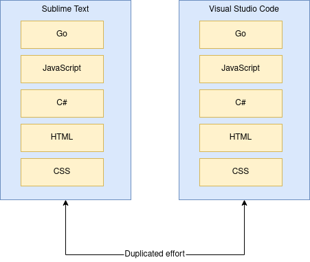
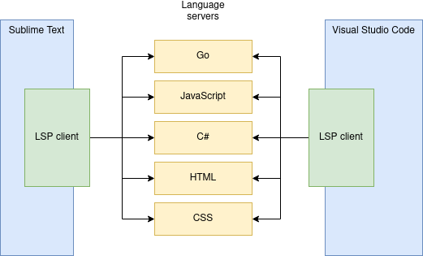
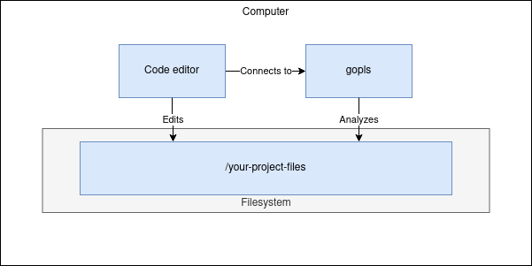
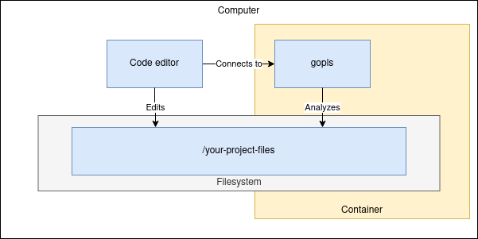

Language server support
=======================

People like nice things:

- Code completion
- Analysis about problems
- Refactoring (rename a variable/function/etc everywhere where it's used)
- Hints for function parameters

A [language server](https://langserver.org/) is a modern way to get these in your favourite code editor.


Why a language server?
----------------------

Before language servers, each code editor had to have built-in support (code completion, analysis, ...)
for each specific language. It looked like this:



Now with a language server, the logic that used to be implemented inside each
code editor separately for a given language can live inside a single language-specific
server, and all the code editors can use that one server to parse information for that language.

A code editor needs to only implement the Language Server Protocol ("LSP") standard to gain access
to all the languages - because you now know how to talk each specific language's language server:



For Go, its language server is named [gopls](https://github.com/golang/tools/tree/master/gopls).
Usually a code editor starts the LS as its child process and communicates with it using stdin/stdout -
but network (TCP/IP) is also widely supported.


How the language server is usually used
---------------------------------------

This is how LS's are "traditionally" used:




Using a LS with Bob
-------------------

### Differences to traditional use

Bob's a bit different. Bob likes for all build tooling to be inside containers (the advantages are
already discussed in the top-level documentation), thus we need `gopls` to be in a container.
The process has to look like this:



Because traditionally the code editor and the language server is expected to be in the same
computer (or to be more exact with containers: the same namespace), there usually is a difference
in the expectations of default usage behaviour and how you want to use it with Bob. Specifically:

|  | Traditional approach | Containerized way |
|-------------------------|---|---|
| Start a language server | An editor starts `gopls` as a child process | We want to start `gopls` inside a container |
| Multiple LS instances? | An editor expects one `gopls` instance to be able to access any Go-based project | Each project (also the LS) is in own container, so it can only access the chosen project's files |
| File access | Filesystem from editor's & LS's perspective are the same | Host and container filesystems are separated. We can map host paths (like a given project's files) into a container, but paths can be different from host and container perspectives. |

More about file access: e.g. `/home/joonas/work/turbobob` could get mounted in `/workspace` inside a
dev container (the one you get a shell in with `$ bob dev`). Therefore instead of reusing the same
dev container, a language server gets its own container (still based on the same builder image!) for
the purpose of trying to make the paths look the same. This is also a good approach because you
don't want your language server stopping if you exit the dev shell.

To help bridge these differences, Bob has a small shim (`$ bob tools langserver`) that handles
starting an LS in a container with the right parameters. The shim isn't strictly necessary, as you
could just rig the `$ docker run ... some/docker-image gopls` command directly into your editor's
LSP config, but it contains so many project-specific parameters (Docker image & its version to use,
project directory path) that it's easier to use the shim.

Editors expect each LS to be without much config (let alone project-specific config) because
traditionally each LS isn't project-specific - one LS instance deals with all of your Go-based projects.

We're swimming a bit against the current here. I'd still say it's a good tradeoff, because Bob enables
ones host system to contain minimal state, and now we can't get version conflicts if a new langserver
doesn't work with an old project anymore. Now a project specifies its langserver it's compatible with. :)


### Beta quality warning

The LSP support is in beta stage. It is working at least in my test setup and there isn't major hacks
preventing wider use - but I haven't tested it more languages and editors yet.

The following has been tested to work with Go code: Bob + Sublime Text + gopls.


### Known issues

Here be dragons - Bob's LSP shim isn't perfect yet:

- Depending on your editor you might be able to only access one project at a time for each given
  language (unless you create different "langserver instance" configs for each project in your editor).
  At least Sublime Text expects that if one `gopls` instance is running, it can use that instance to
  access projects A and B, but the `gopls` is in A's container (assuming that project was opened
  first and as a result the langserver was launched) and thus can't access B's files.

- A LS performance can benefit from sharing build/package caches/etc with your build tools. Currently
  these caches are not shared.

- We rely on the editor launching the LS shim in project's root directory (so the shim can resolve
  which project it refers to). Sublime Text does this, but only sort of, because it resolves symlinks and
  if we map the symlink-target -based path to the LS container, the editor and LS do not see the same
  paths. We have a hack to work around this, but currently it only works on my machine. :D


### Configuration instructions

We're assuming you're using Sublime Text and Go language, but the overall process is the same for every editor:

- Make sure the editor supports LSP. If not directly, it might have a plugin

- There usually is per-language configuration to enable LSP by specifying a command the editor runs
  to start the LS

[Install sublimelsp plugin](https://github.com/sublimelsp/LSP) to get Sublime to support LSP.

Edit LSP (user-specific) settings to contain:

```json
{
	"clients": {
		"gopls": {
			"command": ["bob", "tools", "langserver"],
			"enabled": false
		}
	}
}
```

Use `"enabled": false` to not globally enable the language server client. (read the known issues)

This example is for Go (= gopls), but you can replace any language's langserver config to point
to Bob's langserver shim. Bob internally knows which concrete langserver to start based on your
project's builder image.

Your build container has to have
[language server support integration enabled](https://github.com/function61/buildkit-golang/blob/8496e47f8f39f62e05be3e10de8c97f588336f6d/turbobob-baseimage.json#L10).

Now you can `LSP: Enable Language Server in Project` and open a `.go` file!


### Troubleshooting

Tips:

- Editors usually have output windows for the langserver integration - it should show any errors.

- You could try running `$ bob tools langserver` (in your project's root directory!) to see if you get
  any error. Don't worry if the command "hangs", because that's expected - you have to give input to the
  server before it responds. A good test is `Content-Length: 3\n\nfoobar\nfasdfasdf` (use enter keys
  for `\n`'s). A healthy server should respond that your input was garbage.

- Did you read this document thoroughly?
