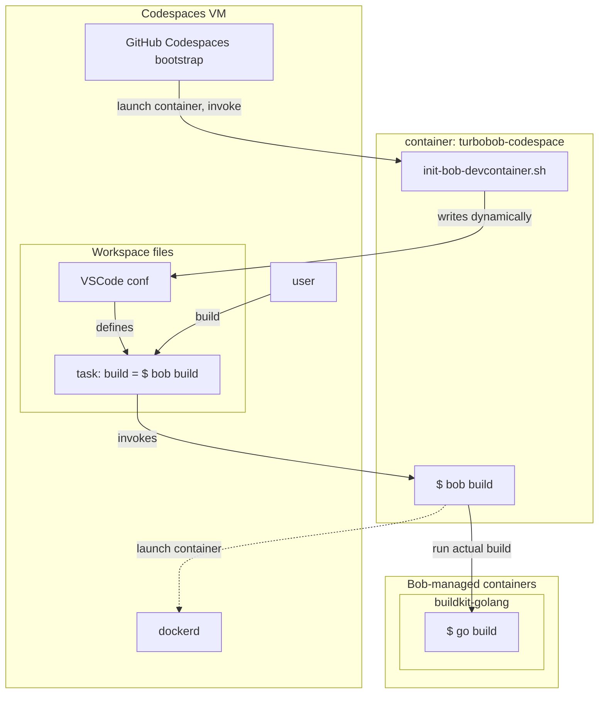

turbobob-codespace
==================

Produces a [dev container](https://containers.dev/) specifically intended to enable integrating a repo with
[GitHub Codespaces](https://github.com/features/codespaces).

Goals

- Integrate as many low-hanging fruit features as possible from Turbo Bob with GitHub Codespaces with minimal changes to concrete repos.

Non-goals:

- Work as a standalone dev container outside of GitHub Codespaces context.


Architecture
------------




Use from concrete repo
----------------------

Define `.devcontainer/devcontainer.json`:

```json
{
  "$schema": "https://raw.githubusercontent.com/devcontainers/spec/main/schemas/devContainer.schema.json",
  "name": "Turbo Bob",
  "image": "ghcr.io/function61/turbobob-codespace:latest",
  // needed for at least mount command done by `init-bob-devcontainer.sh`
  "privileged": true,
  // for some reason the mount args given here do not work if given in the `mounts` field
  "runArgs": [
     // to be able to copy Bob to host-side
     "--mount=type=bind,source=/,destination=/host"
   ],
  // prepares the container so it can succesfully launch sibling containers from Bob.
  // think of this as adapter for Bob running inside devcontainer.
  "onCreateCommand": ["/usr/bin/init-bob-devcontainer.sh"],
  "mounts": [
    "type=bind,source=/var/run/docker.sock,destination=/var/run/docker.sock"
  ]
}
```


Build
-----

```shell
docker buildx build -t ghcr.io/function61/turbobob-codespace:latest . --push
```

Resources
---------

- https://github.com/qdm12/godevcontainer/blob/master/.devcontainer/devcontainer.json
- https://github.com/devcontainers/images/blob/main/src/go/.devcontainer/devcontainer.json
- https://github.com/qdm12/godevcontainer/blob/master/.devcontainer/devcontainer.json
